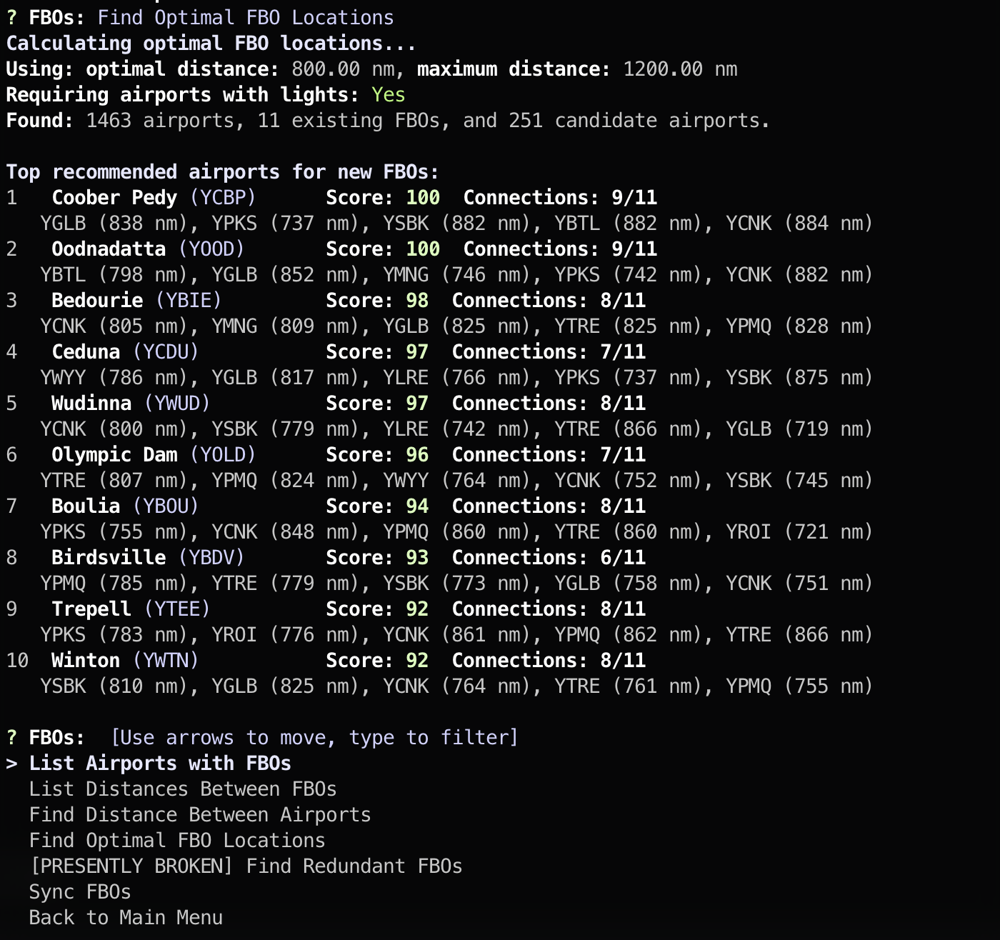

# OffAir: The OnAir CLI Companion



## Overview
OffAir is a command-line interface (CLI) tool designed to complement [OnAir](https://www.onair.company), a proprietary commercial flight simulation and management platform. This tool allows users to interact with OnAir data, particularly focusing on airport and Fixed Base of Operations (FBO) management and optimisation.

## Purpose
The primary purpose of OffAir is to provide additional functionality for OnAir users, enabling you to:
- Look up and modify airport information
- Manage FBOs (Fixed Base Operators)
- Calculate distances between airports and FBOs
- Find optimal FBO locations
- Identify redundant FBOs
- Synchronise FBO data from OnAir

## Current Status
**Working Draft - Developer Oriented**

OffAir is in development and is oriented towards developers. The interface and functionality may change as development progresses.

## Requirements
- An OnAir API key (set as the `ONAIR_API_KEY` environment variable)
- Go programming language (for building from source)

## Usage
1. Set your OnAir API key in the environment:
   ```
   export ONAIR_API_KEY=your_api_key_here
   ```
   Or create a `.env` file (in the working directory) with the following content:
   ```
   ONAIR_API_KEY=your_api_key_here
   ```
   Optionally, also set `ONAIR_COMPANY_ID` to sync a company's FBOs directly from OnAir.

2. Run the application:
   ```
   go run main.go
   ```

3. Navigate through the interactive menus to access features.

## Disclaimer
OffAir is an independent, unofficial tool and is not affiliated with, endorsed by, or in any way officially connected to OnAir Company or any of its subsidiaries or affiliates. The official OnAir website can be found at [https://onair.company](https://onair.company).

All data used by this tool is sourced from OnAir's API and remains subject to OnAir's terms of service and licensing. Users of this tool must comply with OnAir's terms of service when accessing and using OnAir data.

## Legal
This tool is provided "as is", without warranty of any kind, express or implied, including but not limited to the warranties of merchantability, fitness for a particular purpose, and noninfringement. In no event shall the authors or copyright holders be liable for any claim, damages, or other liability, whether in an action of contract, tort, or otherwise, arising from, out of, or in connection with the software or the use or other dealings in the software.

## License
See [LICENSE](LICENSE).

Please note that while the code and documentation of this project are licensed on their own, the concepts and the data pulled from [OnAir](https://www.onair.company) are proprietary and subject to [OnAir's terms and conditions](https://www.onair.company/terms-conditions/).
